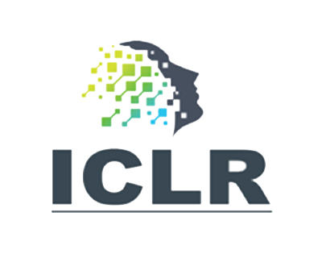

# [Label Encoding for Regression Networks ](https://openreview.net/pdf?id=8WawVDdKqlL)

[Deval Shah](https://www.linkedin.com/in/deval-shah-91485867/), [Zi Yu Xue](), [Tor M. Aamodt](https://www.ece.ubc.ca/~aamodt/)

This repository contains code for the work on "Label Encoding for Regression Networks"  presented in the ICLR 2022 (Spotlight presentation) [paper](https://openreview.net/pdf?id=8WawVDdKqlL). 

Table of Contents
=================

[Head pose estimation with ResNet50](hpe_resnet50): Training and inference code with trained models for head pose estimation with ResNet50 feature extrctor and BEL. 
[Head pose estimation with RAFA-Net](hpe_rafanet): Inference code with trained models for head pose estimation with RAFA-Net feature extrctor and BEL. 
[Facial landmark detection with HRNetV20W18](facial_detection): Training and inference code with trained models for facial landmark detection with HRNetV2-W18 feature extrctor and BEL. 
[Age estimation with ResNet50](age_estimation): Inference code with trained models for age estimation with ResNet50 feature extrctor and BEL. 
[End-to-end autonomous driving with PilotNet](pilotnet): Inference code with trained models for end-to-end autonomous driving with PilotNet feature extrctor and BEL. 

## Citation

If you find this project useful in your research, please cite:

```
​```
@inproceedings{ShahICLR2022
  author    = {Shah, Deval and Xue, Zi Yu and Aamodt, Tor M },
  booktitle = {nternational Conference on Learning Representations},
  title     = {Label Encoding for Regression Networks},
  url = {https://openreview.net/pdf?id=8WawVDdKqlL},
  month     = {April},
  year      = {2022},
}
​```
```